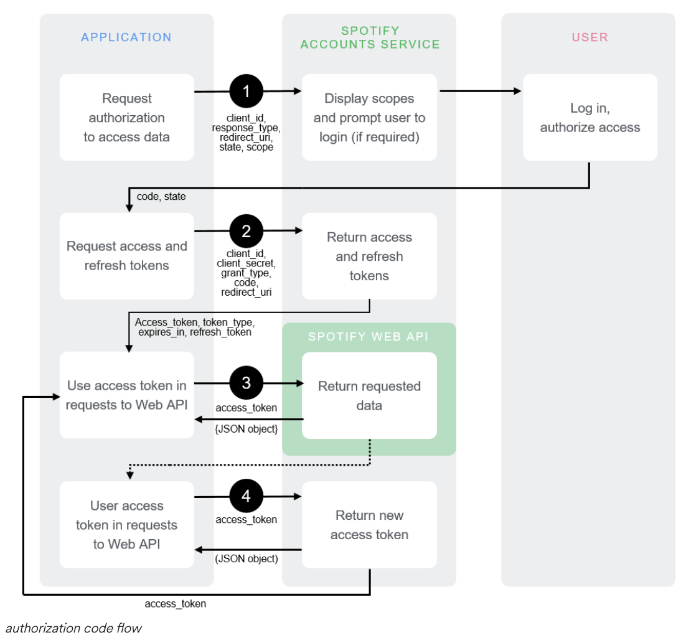

## Domain

The idea of our framework is to provide statistical analysis and visualizations of users’ music tastes. The users in our domain include everyone who listens to music and is curious about their listening habits. For example, the users might want to see trends or patterns in their listening histories. To fulfill these needs, our framework will let the users log in to their music accounts and then perform various analyses. The analyses include finding the most listened to genres, tracks, artists, etc. After getting the data, our framework will produce visual representations of this information in interesting and understandable formats. 

The data plugins will be used to gather information about the user’s music account. The plugins we currently support are:
* Spotify plugin that allows users to log in to their Spotify account using the Spotify API
* Last FM plugin that allows users to login with their Last FM account using the LastFM API

The visualization plugins will be used to display visualizations of results. Some include:
* [Definitely doing] Word cloud containing words from music genres. The music genre the user listens to the most will appear bigger in the word cloud and vice versa. 
* [Definitely doing] Bar graph of the top 10 most common tracks the user listens to vs. its popularity
* [Might do] Color map showcasing the moods of the tracks the user listens to
* [Might do] Line graph showing the time of day the user tends to listen to music

## Generality vs specificity

<ins>Generality vs. Specificity</ins>

Our framework will be a black-box framework which means we will have an overall interface for our framework. Our framework will have abstractions to allow the users to get the data from the data plugin, do any necessary processing of the data, then pass the data to the visualization plugins. We use an interface to make these functions general because the framework should accept various forms of data from different sources. Similarly, it should be able to process data in various forms either as json or csv files. Hence, using an interface make our framework general since it can take in and process various types of data. The generality of our framework comes in the form that it can handle all data plugins the same way even though they are from different sources or have different formats. 

The specificity of our framework comes from the fact that we are targeting music data specifically, so many of our processing and data extractions will be focused on music-related statistics and behaviors. Our visual plugins are also specifically designed for word clouds and bar graphs. This makes our framework specific because if the user wants to do text processing or create line graphs, they can’t use our framework to do so.

<ins>Key Abstractions</ins>

Some key abstractions for our framework include methods such as setFooter(), registerPlugin(), retrieveData(), processData(), passDataToVisuals() etc. The users can use these methods to load their data plugins, get and process the data, then create visualizations.  For example, the framework can pass the list of genres provided by a data plugin to the word cloud visualization plugin, which will convert it into a word cloud. It will also pass the top 10 most listened to songs in the user’s listening history to the bar graph visualization plugin. Since we have an interface, the users do not need to know how the framework does the processing, but instead they can use these functions to get the result they want.

<ins>Reusability</ins>

The reusability of our framework comes from the fact that the users can provide any types of data, and our framework will be able to process them. As discussed earlier, we will use an interface to ensure our framework can accept data from different sources, process different types of data, and generate the visualizations. Hence, using an interface here can provide abstractions that increase the reusability of our framework.

<ins>Plugin Flexibility</ins>

We will also have abstractions through plugin interfaces. The data plugin interface will provide several functionalities such as getting the name of the music service (Spotify or LastFM), getting the listening histories, getting the most common genres and tracks, etc. The methods in this interface are abstractions that users can use to get data about listening histories without directly interacting with the APIs. We will have two specific classes implementing this interface for Spotify and LastFM to concretely implement the methods to get the information we need respectively. 

This provides flexibility for the plugins because each plugin can implement these methods differently. For example, the process of retrieving genres differs among the plugins we support: The LastFM API stores genre information in a song’s tags array, while the Spotify API stores it in the artist’s genre array. From this, it’s evident that the way to retrieve genres is different among various music streaming services. With the plugin interface, we can separate the implementations for the two APIs and hide the details from the users. This provides flexibility as working with different APIs often requires different steps.

## Project structure

All files will be contained within the topmost folder, which we have named com.spotifindafriend.hw6. 
From there, we have several folders:
* /core folder contains:
    * a MusicTrackerFramework interface, which loads plugins and passes the data generated from the data plugins to the visualization plugins
    * a MusicTrackerFrameworkImpl class that implements MusicTrackerFramework. The plugins will be loaded in this class.
    * a DataPlugin interface, which will contain generic methods that each specific data plugin can implement
    * a VisualizationPlugin interface, which will contain generic methods that each specific visualization plugin can implement
* /dataPlugin folder contains all the data plugins:
    * SpotifyPlugin.java
    * LastFMPlugin.java
* /visualizationPlugin folder contains all the visual plugins:
    * WordCloudPlugin.java
    * BarGraphPlugin.java
* /resources folder containing a list of plugins to be registered by framework

We will also include a custom Song class, documented in more detail below. 


## Plugin interfaces
### Overview
We will have two data plugins: one for retrieving information from Spotify and the other for Last FM. The key methods in each data plugin are logging in and retrieving the user’s listening history. The login method will redirect the user to the corresponding API’s login page. Once the user is logged in, the plugins will call the corresponding API’s methods to retrieve top genres, most listened to songs, and their popularity. Then, the data plugins will modify the data to be in its required format to pass to the visualization plugins.

### API Endpoints
### Last.fm

<ins>Logging In</ins>

The user will be prompted to enter their last.fm username. Once the “submit” button is clicked, the login method will take the input stored by the HTML form and pass it into the data retrieval method (documented below) as a username parameter. The user does not actually need to “log in” for the last.fm API to retrieve their listening history—the API only requires the person’s username.

<ins> Retrieving Data for Most Listened to Tracks</ins>

The last.fm API will return information about a user’s most listened to tracks in a JSON file using the url http://ws.audioscrobbler.com/2.0/?method=user.gettoptracks&user=rj&api_key=YOUR_API_KEY&format=json. The method used is `user.getTopTracks(). `

This API call takes in several parameters:
* user (required): The username to fetch top tracks for
* api_key (required): A Last.fm API key
* period (optional): The time period over which to retrieve top tracks for, defaults to overall
* limit (optional): The number of results to fetch per page, defaults to 50
* page (optional): The page number to fetch, defaults to the first page

We will be giving the API our own generated API key, and the plugin will take in the username from the logging in action. We will be using the default optional parameters of limit and page, and 6 month for period. (For more information on the default values, [here](https://www.last.fm/api/show/user.getTopTracks) is the link to the API’s documentation.)

The information we will need to extract from the JSON response are the name of the song, the name of the artist, the mbid of the artist and song, and the small image url. This information will be stored in a custom Song object to get necessary data and create the visualizations. 

A sample Song object would be defined as:
```
public Class Song {

private String song;
private String artist;
private String artist_id;
private String song_id;
private String img_url;
private Int popularity;

public Song(String song, String artist, String artist_id, String song_id String img, Int popularity) {

this.song = song;
this.artist = artist;
this.artist_id = artist_id;
this.song_id = song_id;
this.img_url = img;
this.popularity = popularity; }}
```
with corresponding getter and setter methods for each attribute. The popularity attribute is not set in this first API call—see below.

<ins>Retrieving Data for Track’s Popularity</ins>

The last.fm API will return information about a track in  a JSON file using the url
http://ws.audioscrobbler.com/2.0/?method=track.getInfo&api_key=YOUR_API_KEY&artist=cher&track=believe&format=json. The method used is `track.getInfo`.

This API call takes in several parameters:
* mbid (Optional) : The musicbrainz id for the track
* track (Required (unless mbid)] : The track name
* artist (Required (unless mbid)] : The artist name
* api_key (Required) : A Last.fm API key.
* username (Optional) : The username for the context of the request. If supplied, the user's playcount for this track and whether they have loved the track is included in the response.
* autocorrect[0|1] (Optional) : Transform misspelled artist and track names into correct artist and track names, returning the correct version instead. 

Since we will be doing this step after retrieving the user’s top 10 tracks information, we will already have the mbid for each song. So we will be passing in the song_id from the Song object as mbid, and our API key. 

The response returned will be a JSON file. The attributes we are interested in are playcount and listeners which give the number of times the song was played and the number of listeners it has. We will use these two numbers to calculate the track’s popularity, then populate the popularity field in the corresponding Song object.


<ins> Retrieving Data for Song Genres </ins>

The last.fm API will return the genre information in a JSON file using the url http://ws.audioscrobbler.com/2.0/?method=track.gettoptags&artist=radiohead&track=paranoid+android&api_key=YOUR_API_KEY&format=json. The method is `track.getTopTags. `

This API call takes in several parameters:
* track (Required): The track name
* artist (Required): The artist name
* api_key (Required): A Last.fm API key.
* mbid (Optional): The musicbrainz id for the track
* autocorrect[0|1] (Optional): Transform misspelled artist and track names into correct artist and track names, returning the correct version instead. 
 
We will be giving the API our own generated API key, and it will take the artist and track parameters from the various Song objects for the user’s most listened to tracks we extracted earlier. The information we will need to extract from this JSON file is the name of each of the tags returned, which will be stored in a string array for the word cloud generator. 

### Spotify

<ins>Logging In</ins>

Using the Spotify authorization API requires registering the app in the official developer portal, which returns the client_id and client_secret needed for authentication. Authentication also requires a redirect_uri, which we set to localhost:3000 for this project. When the user clicks the Login with Spotify option, they will be redirected to Spotify’s custom login page. There, the user can choose to login through their email, Facebook account or just directly type in their Spotify credentials. 

Once the user logs in successfully, the callback returns an authorization code and a status state, which is exchanged for a personal access token by making a post request at the /api/token endpoint. Since the access token expires every hour, the post request also returns a refresh token which can be used to generate a new access token. An official diagram of the process is detailed here.




<ins>Retrieving Data for Most Listened to Tracks & Its Popularity</ins>

To retrieve a user’s most listened to tracks, we will use a GET request to the API with 
GET https://api.spotify.com/v1/me/top/tracks. 

This API takes in several parameters:
* Type (required): the type of top items we are retrieving. In our case this will be “tracks”
* time_range (optional): Over what time frame the affinities are computed. We will be using “medium_term”
* limit (optional): The maximum number of items to return. We will be using 10.
* offset (optional): The index of the first item to return. We will be using 0.

The data will be returned in the form of a JSON file. The information we will need to extract from this file are the song name and id, the artist name and id, the image url, and its popularity. This information will be stored in the Song class documented above. 

<ins>Retrieving Data for Song Genres</ins>

To get the genres of a song, we will use a GET request to the API with
 GET https://api.spotify.com/v1/artists/{id}.

This endpoint takes in the id of the artist, which we will be replacing with the artist_id attribute from each Song object. The data will be returned in the form of a JSON file. The information we will extract is the genres list.

### Interface Methods
The methods in our data plugin interface will include:
* logIn
* getTopTracks
* getTopGenres
* getPopularityScore
* getMusicServiceName

The methods in our data visualization interface will include:
* makeWordCloud
* makeBarGraph

### Key Data Structures
The key data structures to pass to the framework are the list of aggregated genres and the list of 10 Song objects for the user’s top tracks.

### Passing Data to Visualization
Both data plugins will be returning information in a String array for aggregated genres, and an array of 10 Song objects for a user’s top tracks. The word cloud plugin will take the array of genres, calculate the frequency of each genre, and generate a word cloud. The bar graph plugin will take in the list of Song objects, get the name/image of the track and its popularity to create the visualization.


